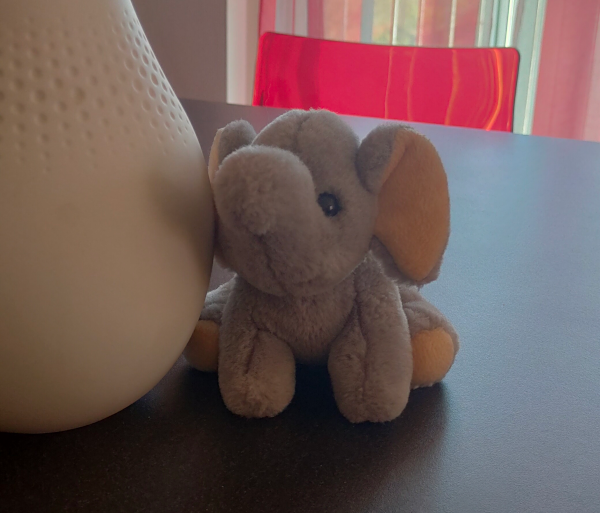

# Bubu

A Italian-to-Bubu translator

---

<a href="https://www.kesiev.com/bubu/">Translate to Bubu</a> <i>(Italian only)</i>

---

## The story

A legend says that every puppet has its planet in which they look the same and live their lives together. Some dream of leaving their planet and exploring the Earth... but how can they do that without a spaceship? A few days after a real puppet joins your home, whether buying it or making it by yourself, one soul from its matching planet may enter its fluffy body from time to time, to see what we're doing. They can't move or talk - _obviously_ - but, if you _never stop dreaming_, you can _hear them_ and _know how they want to move their tiny bodies_!

There are _turtles flying like UFOs_! There are _questioning giraffes_! There are _royal cats_! There even are _worms that can say just a single letter_!

**Bubu** is one of them. It is an exuberant and very talkative tiny elephant, that has lived with us for years and loves cynically comment on our lives. It also loves saying _bad words_ from time to time without knowing the meaning because it just loves its sound.

    

It speaks Italian with a very high-pitched voice... but it has some defective pronunciation that is quite common _in some puppets_. Many words have the same sound so it's hard (and fun) to translate its words into Italian. So, I've put together a translator from Italian to Bubu to help you understand them - or to speak like them. It's not accurate but it mostly does the job.

## The project

### Why?

Never let the child inside you die. It's the most reliable judge of your life you will ever have.

### Credits

Thank you to **Bianca**, the mother and friend of many crazy puppets.
